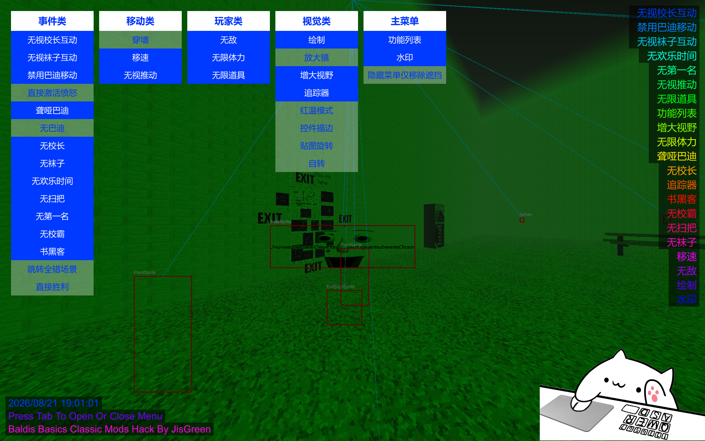
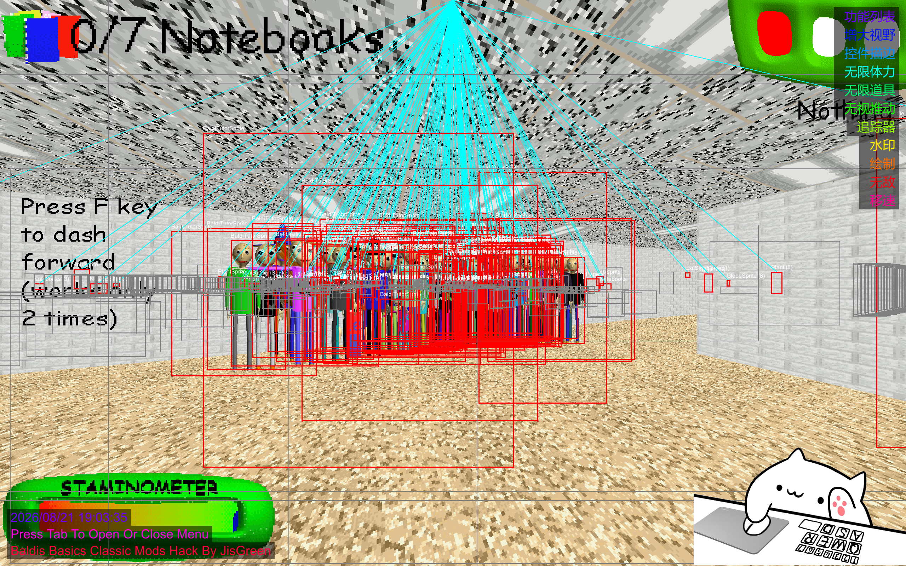

# Baldi's Basics Classic Mods Hack 1.1

基于 __BepInEx 5.4.23__ ，针对 __Baldi's Basics Classic__ 以及社区衍生的 __模组版本__ 打造的通用作弊菜单。

__我不保证全部功能都能正常在所有版本正常运行！__

---

## 功能列表

### 事件类
| 功能 | 说明 |
|------|------|
| 无视校长互动 | Principal 无法抓住你。 |
| 无视袜子互动 | Arts and Crafters 无法传送。 |
| 禁用巴迪移动 | Baldi 完全停止移动。 |
| 直接激活愤怒 | 立即让 Baldi 进入愤怒状态。 |
| 聋哑巴迪 | Baldi 永久失去听力，无法响应声音。 |
| 无巴迪 | 隐藏 Baldi。 |
| 无校长 | 隐藏 Principal。 |
| 无袜子 | 隐藏 Arts and Crafters。 |
| 无欢乐时间 | 隐藏 Playtime。 |
| 无扫把 | 隐藏 Gotta Sweep。 |
| 无第一名 | 隐藏 1st Prize。 |
| 无校霸 | 隐藏 Bully。 |
| 书黑客 | Q 键增加笔记本，E 键减少笔记本。 |
| 跳转全错场景 | 立即跳转到全错结局。 |
| 直接胜利 | 立即跳转到普通胜利结局。 |

### 移动类
| 功能 | 说明 |
|------|------|
| 穿墙 | 关闭碰撞检测。 |
| 移速 | 二倍移动速度。 |
| 无视推动 | 免疫 Gotta Sweep 和 1st Prize 的推动。 |

### 玩家类
| 功能 | 说明 |
|------|------|
| 无敌 | 无视 Baldi 击杀以及 Playtime 互动。|
| 无限体力 | 体力永不消耗。 |
| 无限道具 | 使用道具不消耗。 |

### 视觉类
| 功能 | 说明 |
|------|------|
| 绘制 | 红色方框透视所有 Sprite，显示名称。 |
| 放大镜 | 缩小视野，类似望远镜效果。 |
| 增大视野 | 增大视野范围。与放大镜同时开启则恢复默认。 |
| 追踪器 | 从每个 Sprite 方框顶部连线到屏幕顶部中心。 |
| 红温模式 | 全局环境光变为红色。 |
| 控件描边 | 灰色方框透视所有 Mesh 模型。 |
| 贴图旋转 | 让所有 Billboard 贴图疯狂随机旋转。 |
| 自转 | 相机自动顺时针旋转。 |

### 主菜单
| 功能 | 说明 |
|------|------|
| 功能列表 | 屏幕右上角显示已开启的功能，同时拥有美观的RGB渐变。 |
| 水印 | 左下角显示文字，同时拥有美观的RGB渐变。 |
| 隐藏菜单仅移除遮挡 | Tab 隐藏菜单时保留5个面板，仅移除灰色背景和冻结效果。 |

---

## 安装方法

1. 下载 [`BepInEx 5.4.23`](https://github.com/BepInEx/BepInEx/releases)。
2. 将 `BepInEx` 解压到游戏根目录。
3. 下载 `BaldisBasicsClassicModsHack.dll`。
4. 将 `BaldisBasicsClassicModsHack.dll` 放入 `BepInEx/plugins/` 文件夹。
5. 启动游戏，按 `Tab` 关闭或开启菜单。

---

## 免责声明

本工具仅供学习交流使用，请勿用于在线模式或商业用途。使用本工具可能导致游戏存档损坏或账号封禁，作者不承担任何责任。

---

## 开源协议

MIT协议。

---

**Baldis Basics Classic Mods Hack By JisGreen**
